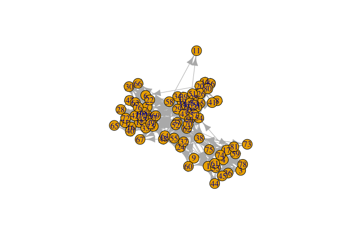
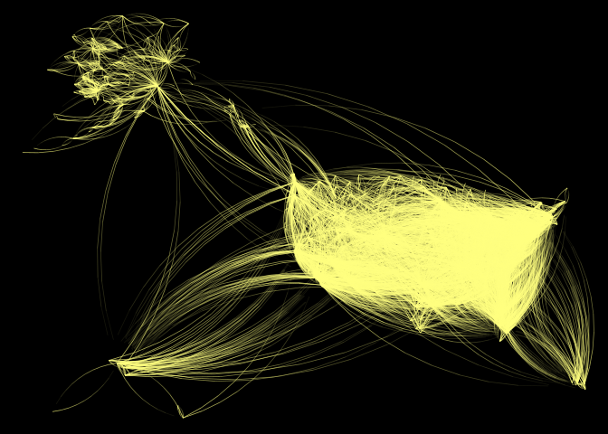

<!-- README.md is generated from README.Rmd. Please edit that file -->

# netplot

[](https://github.com/USCCANA/netplot/actions/workflows/r-check.yml)
[](https://ci.appveyor.com/project/gvegayon/netplot)
[](https://www.tidyverse.org/lifecycle/#experimental)
[](https://preventivemedicine.usc.edu)

An alternative graph visualization engine that puts an emphasis on
aesthetics at the same time of providing default parameters that provide
visualizations that are out-of-the-box nice.

Some features:

1.  Auto-scaling of vertices using sizes relative to the plotting
    device.
2.  Embedded edge color mixer.
3.  True curved edges drawing.
4.  User-defined edge curvature.
5.  Nicer vertex frame color.
6.  Better use of space filling the plotting device.

The package uses the `grid` plotting system (just like `ggplot2`).

## Installation

<!-- You can install the released version of netplot from [CRAN](https://CRAN.R-project.org) with: -->
<!-- ``` r -->
<!-- install.packages("netplot") -->
<!-- ``` -->

And the development version from [GitHub](https://github.com/) with:

``` r
# install.packages("devtools")
devtools::install_github("USCCANA/netplot")
```

## Example

This is a basic example which shows you how to solve a common problem:

``` r
library(igraph)
#> 
#> Attaching package: 'igraph'
#> The following objects are masked from 'package:stats':
#> 
#>     decompose, spectrum
#> The following object is masked from 'package:base':
#> 
#>     union
library(netplot)
#> 
#> Attaching package: 'netplot'
#> The following object is masked from 'package:igraph':
#> 
#>     ego
set.seed(1)
data("UKfaculty", package = "igraphdata")
l <- layout_with_fr(UKfaculty)

plot(UKfaculty, layout = l) # ala igraph
```



``` r
nplot(UKfaculty, layout = l) # ala netplot
```


``` r
sna::gplot(intergraph::asNetwork(UKfaculty), coord=l)
```


### UKfaculty

``` r
# Random names
set.seed(1)
nam <- sample(babynames::babynames$name, vcount(UKfaculty))

ans <- nplot(
  UKfaculty,
  layout                = l,
  vertex.color          = grDevices::hcl.colors(5, "Plasma")[V(UKfaculty)$Group + 1],
  vertex.label          = nam,
  vertex.size.range     = c(.01, .04, 4),
  vertex.label.col      =  "black",
  vertex.label.fontface = "bold",
  bg.col                = "transparent",
  vertex.label.show     = .5,
  vertex.label.range    = c(10, 25),
  edge.width.range      = c(1, 4, 5)
  )


# Plot it!
ans
```


### USairports

``` r
# Loading the data
data(USairports, package="igraphdata")

# Generating a layout naively
layout   <- V(USairports)$Position
layout   <- do.call(rbind, lapply(layout, function(x) strsplit(x, " ")[[1]]))
layout[] <- stringr::str_remove(layout, "^[a-zA-Z]+")
layout   <- matrix(as.numeric(layout[]), ncol=2)

# Some missingness
layout[which(!complete.cases(layout)), ] <- apply(layout, 2, mean, na.rm=TRUE)

# Have to rotate it (it doesn't matter the origin)
layout <- netplot:::rotate(layout, c(0,0), pi/2)

# Simplifying the network
net <- simplify(USairports, edge.attr.comb = list(
  weight = "sum",
  name   = "concat",
  Passengers = "sum",
  "ignore"
))

# Getting a pretty color

f <- 1.5
col <- adjustcolor(
  rev(grDevices::hcl.colors(10, alpha = .5))[1],
  red.f = f, blue.f = f, green.f = f
  )

nplot(
  net,
  layout            = layout,
  edge.width        = E(net)$Passengers,
  vertex.color      = col,
  skip.vertex       = TRUE,
  vertex.size.range = c(0,0),
  edge.width.range  = c(.75, 4, 4),
  bg.col            = "black"
  )
```


