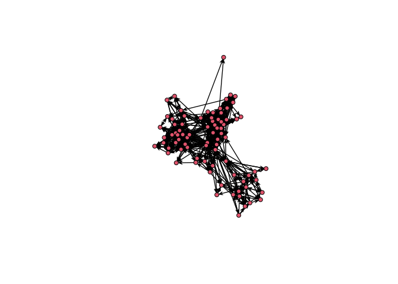

<!-- README.md is generated from README.Rmd. Please edit that file -->
netplot
=======

[](https://travis-ci.org/USCCANA/netplot) [](https://ci.appveyor.com/project/gvegayon/netplot)

An alternative graph visualization engine that puts an emphasis on aesthetics at the same time of providing default parameters that provide visualizations that are out-of-the-box nice.

Some features:

1.  Auto-scaling of vertices using sizes relative to the plotting device.
2.  Embedded edge color mixer.
3.  True curved edges drawing.
4.  User-defined edge curvature.
5.  Nicer vertex frame color.
6.  Better use of space filling the plotting device.

The package uses the `grid` plotting system (just like `ggplot2`).

Installation
------------

<!-- You can install the released version of netplot from [CRAN](https://CRAN.R-project.org) with: -->
<!-- ``` r -->
<!-- install.packages("netplot") -->
<!-- ``` -->
And the development version from [GitHub](https://github.com/) with:

``` r
# install.packages("devtools")
devtools::install_github("USCCANA/netplot")
```

Example
-------

This is a basic example which shows you how to solve a common problem:

``` r
library(igraph)
#> 
#> Attaching package: 'igraph'
#> The following objects are masked from 'package:stats':
#> 
#>     decompose, spectrum
#> The following object is masked from 'package:base':
#> 
#>     union
library(netplot)
set.seed(1)
data("UKfaculty", package = "igraphdata")
l <- layout_with_fr(UKfaculty)

plot(UKfaculty, layout = l) # ala igraph
```


``` r
nplot(UKfaculty, layout = l) # ala netplot
```


``` r
sna::gplot(intergraph::asNetwork(UKfaculty), coord=l)
```



``` r
# Random names
set.seed(1)
nam <- sample(babynames::babynames$name, vcount(UKfaculty))

ans <- nplot(
  UKfaculty,
  layout                = l,
  vertex.color          = viridis::plasma(5)[V(UKfaculty)$Group + 1],
  vertex.label          = nam,
  vertex.size.range     = c(.01, .04, 4),
  vertex.label.col      =  "black",
  vertex.label.fontface = "bold",
  bg.col                = "transparent",
  vertex.label.show     = .5,
  vertex.label.range    = c(10, 25),
  edge.width.range      = c(1, 4, 5)
  )


# Plot it!
ans
```


